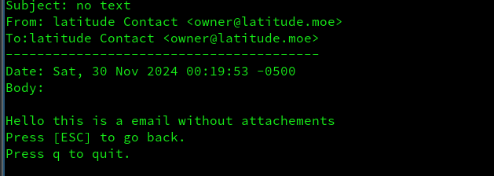

# apt-e-client

# How to setup
1. setup a client secrets following this https://developers.google.com/gmail/api/quickstart/go
2. put the credentials into a local folder call secret, path will be `secret/credentials.json`
3. run
```bash
go build . && ./apt-e-client
 ```


